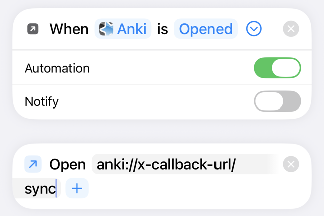

# My Daily English — Anki 自動化單字系統

個人英文單字學習系統，基於 Anki + AnkiConnect。輸入一個單字，例句、圖片、語音、翻譯全部自動生成。

---

## 系統架構

用到的外部服務：

| 組件 | 技術 | 用途 |
|------|------|------|
| LLM | **Groq、Gemini、Cloudflare Workers AI** | 例句、單字翻譯、整句翻譯、圖片搜尋關鍵字 |
| TTS | **edge-tts** | 正面 Andrew 男聲唸單字、背面 Ava 女聲唸句子 |
| 圖片 | **Pexels、Wikimedia Commons、Openverse、Pixabay** | 單字插圖，依序切換 |
| Anki | AnkiConnect | CLI 與 Anki 溝通 |

LLM 依工作分成兩組模型。造句一組，翻譯、搜圖關鍵字與選詞義一組。
一個模型額度用完，就換同組的下一個。
沒放金鑰的服務會自動略過。只放 Groq 金鑰也能用。

程式分四層：

| 層 | 位置 | 職責 |
|----|------|------|
| 共用邏輯 | `core/` | LLM 分流、搜圖、語音、文字處理。CLI 和測試都用它 |
| Anki 插件 | `addon/` | ⌘A、⌘S、⌘F、⌘D 四個視窗。跑在 Anki 裡，不能 import `core/`，所以 LLM 分流有一份鏡像 `addon/_llm_dispatch.py` |
| 插件的外部小程式 | `_image_helper.py`、`_gtts_helper.py`、`_validate_helper.py` | 插件用 subprocess 呼叫，它們再用 `core/` 做搜圖、語音、拼字 |
| 卡片模板 | `templates/` | 卡片長什麼樣 |

---

## 牌組結構

**牌組**：`My Daily English`
**筆記類型**：`English_White_Method`

| 欄位 | 說明 | 填寫方式 |
|------|------|----------|
| `Front` | 單字 | 手動輸入 |
| `Association` | 中文聯想（可選）。圖和例句都照這個意思做 | 手動輸入。沒填時系統自己選一個意思，圖和例句共用，不寫回這個欄位 |
| `Sentence` | 英文例句 | 自動（LLM） |
| `Image_Prompt` | 插圖 | 自動（四個圖源） |
| `Audio` | 句子語音 (Ava) | 自動（edge-tts） |
| `Front_Audio` | 單字發音 (Andrew) | 自動（edge-tts） |
| `Translation` | 單字中文翻譯（背面點擊顯示） | 自動（LLM） |
| `Sentence_CN` | 整句中文翻譯（背面點擊顯示） | 自動（LLM） |

兩個翻譯欄位一律是台灣繁體。LLM 偶爾回簡體，系統會自動轉成繁體。想查舊卡有沒有簡體，跑 `uv run python tools/check_simplified.py`，只列出不改；加 `--fix` 才寫回。

---

## 前置需求

### Anki 套件

- **AnkiConnect**（代碼 `2055492159`）。CLI 需要 Anki 開著才能運作。

### API Keys

在專案根目錄建立金鑰檔：

```bash
echo "gsk_your_key_here" > .groq_key     # Groq，免費：https://console.groq.com
echo "your_key_here"     > .gemini_key   # Gemini，可選，免費：https://aistudio.google.com/apikey
echo "your_key_here"     > .pexels_key   # Pexels，免費：https://www.pexels.com/api
echo "your_key_here"     > .pixabay_key  # Pixabay，免費：https://pixabay.com/api/docs/
```

Cloudflare Workers AI 可選，免費。`.cloudflare_key` 要寫兩行：

```
CLOUDFLARE_ACCOUNT_ID=你的帳號 ID
CLOUDFLARE_API_TOKEN=你的 API Token
```

Wikimedia Commons 與 Openverse 不用金鑰。沒有金鑰的圖源會被略過，其他圖源照常運作。

金鑰在 Anki 插件啟動時讀一次。新增或更換金鑰後要重啟 Anki 才生效。CLI 每次執行時讀。

### Python 環境

在專案根目錄執行 `uv sync`。

---

## 日常使用

四個快捷鍵都可以在 Tools → Shortcuts 重設。

| 快捷鍵 | 功能 | 做什麼 |
|--------|------|--------|
| `⌘A` | Add Word | 輸入單字，自動生成整張卡 |
| `⌘S` | Complete Missing Cards | 補齊缺欄位的卡 |
| `⌘F` | Batch Operations | 批量操作，見下表 |
| `⌘D` | Translation Terms | 審核被誤判的英文術語 |

⌘F 面板：

| 功能 | 做什麼 |
|------|--------|
| Backfill Sentence Translations | 批次補整句翻譯 |
| Clear Flagged Cards | 清空紅旗卡，保留單字和 Association |
| Find Duplicate Words | 找重複單字並刪除 |
| Rebuild Long Sentences | 清空過長例句 |
| Test Cards | 產生或清除測試卡 |

生成中，⌘A 的狀態列和 ⌘S 每一列會顯示現在在做哪一步、用哪個模型、過了幾秒。
找圖最多 10 秒，會倒數。

⌘S 補完一張卡，那一列會出現縮圖。
滑鼠停在那一列，會浮出大圖、例句、整句翻譯和單字翻譯。
用它確認圖和例句是不是同一個意思。

---

## 自動同步

Mac：⌘A、⌘S、⌘F 寫完卡片後會自動同步。沒登入 AnkiWeb 時不會同步。

手機：AnkiMobile 不會自動同步。可以用 iPhone「捷徑」設定成打開 Anki 就同步：

1. 打開「捷徑」App 的「自動化」，新增一個「App」觸發。
2. 選 Anki，勾 Is Opened。
3. 動作選 Open URLs，填 `anki://x-callback-url/sync`。
4. Automation 打開，Notify 關掉。




---

## 好卡範例

複習 3 次以上的卡，會被當成造句的範例。

1. 造句前，系統找出意思最接近的 3 張好卡。
2. 把它們的單字與例句放進 prompt，讓新句子的風格跟著走。
3. 紅旗卡與測試卡不算好卡。

第一次要自己建索引：`uv run python tools/build_example_index.py`（Anki 要開著）。
之後每次按 ⌘S，會自動補進新達標的卡。
索引檔 `example_index.json` 不進版控。沒索引或查不到時，照原本的 prompt 造句。

---

## 專案結構

```
anki/
├── core/                      # 共用邏輯
│   ├── llm.py                 #   LLM 入口：例句、翻譯、搜圖關鍵字
│   ├── dispatcher.py          #   分池的容量感知分流、斷路器
│   ├── providers.py           #   各模型 provider 的呼叫與額度計算
│   ├── image.py               #   四圖源搜尋下載
│   ├── tts.py                 #   edge-tts：Andrew 唸單字、Ava 唸句子
│   ├── text.py                #   去 HTML、正規化、佔位符判斷
│   ├── zh_chars.py            #   簡體字表（tools/gen_zh_chars.py 產生）
│   ├── examples.py            #   載入 addon/_examples.py（好卡範例只有一份實作）
│   └── anki.py                #   AnkiConnect API
├── addon/                     # Anki 插件（symlink 到 Anki 的 addons21，改完要重啟 Anki）
│   ├── __init__.py            #   入口：選單、快捷鍵
│   ├── _config.py             #   常數、路徑
│   ├── _text.py               #   純函式：句子守門、翻譯驗證、術語檔
│   ├── _llm.py                #   LLM 呼叫、造句 prompt
│   ├── _llm_dispatch.py       #   core 分流的鏡像（插件不能 import core）
│   ├── _images.py             #   圖片欄位、退圖紀錄
│   ├── _examples.py           #   好卡範例：向量索引、找相近的卡
│   ├── _batch.py              #   批次互斥、自動同步、視窗共用基礎
│   ├── _workers.py            #   三個背景 worker
│   ├── _dlg_*.py              #   ⌘A、⌘S、⌘F、⌘D、設定 五個視窗
│   └── _sec_*.py              #   ⌘F 面板的五個區塊
├── templates/                 # 卡片模板 front.html、back.html、style.css
├── tests/                     # pytest、conftest.py、兩支 Anki/Qt 相容性檢查
├── tools/                     # 偶爾才跑的工具
├── docs/                      # README 用的圖、設計文件
├── add_word.py                # CLI 新增單字
├── backfill_words.py          # 批次補齊欄位（不含整句翻譯）
├── backfill_sentence_cn.py    # 批次回填整句翻譯
├── regen_audio.py             # 重生所有音檔
├── update_template.py         # 套用模板到 Anki
├── _image_helper.py 等三支    # 插件的外部小程式，見「系統架構」
├── .groq_key 等金鑰檔         # gitignored
├── image_rejects.json         # 退圖紀錄（gitignored）
├── translation_terms.json     # 翻譯術語清單（gitignored）
├── example_index.json         # 好卡範例的向量索引（gitignored）
├── logs/addon_llm.log         # 插件的 LLM 呼叫紀錄，保留最近 3MB（gitignored）
└── pyproject.toml
```

---

## 常見問題

**Q：某個單字圖片不對？**  
A：手機標紅旗，Mac 按 `⌘F` 用 Clear Flagged Cards 清空，再按 `⌘S` 重生，會換圖源。
填了 Association 的卡，會先讓 AI 看過圖、確認是那個意思才放。
找不到程式意思的圖時，會改放日常意思的圖，例如 concrete 放混凝土。
這樣找圖比較慢，一張卡要幾秒到幾十秒。

**Q：音檔唸的是 placeholder 文字？**  
A：跑 `uv run python regen_audio.py` 重新生成所有音檔。

**Q：⌘S 跑完，整句翻譯還是空的？**  
A：翻譯裡有英文術語時，會被當成翻壞了丟掉。按 `⌘D`，在 Pending 把那個術語 Approve，再按 `⌘S`。

**Q：更新改版後，同步時跳出「上傳」「下載」？**  
A：先在 Mac 選上傳。手機同步時若出現同一個對話框，選下載，不要選上傳。
